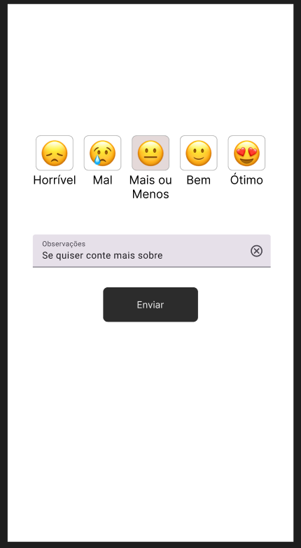
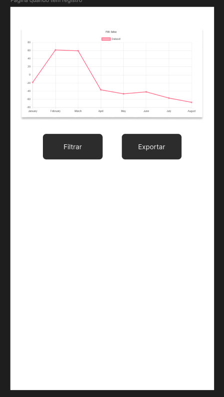

# Especificações

## Regras de negócio

Aplicativo que registra o humor do usuário e gera relatórios baseado no mês atual ou mês escolhido no filtro.

### Páginas

#### Home

Página que deve aparecer caso o usuário não tenha realizado o registro de humor no dia atual.

Imagem meramente ilustrativa para melhorar o entendimento do que se espera. Utilizar as melhores práticas de UX/UI e SEO na construção.

#### Relatorio

Página que deve aparecer caso o usuário já tenha realizado o registro de humor no dia atual.

Imagem meramente ilustrativa para melhorar o entendimento do que se espera. Utilizar as melhores práticas de UX/UI e SEO na construção.

